<center> 

**ELL 888: Advanced Machine Learning**
**Assignment 1**

**Submitted By:**

**Harshdeep Gupta - 2013MT60597**

</center>

# Introduction

In this assignment, we implement a neural network in python from scratch.  We use the scientific computation library numpy to vectorize the calculations, and try to mimic the API provided by Keras for Sequential models.

We implement activation functions, backpropagation algorithm, regularization, loss functions, metrics for accuracy in code.  

# Code Walkthrough

The code is divided across different modules, with the main modules being:

* **Sequential.py**

  This is the main workhorse of the project, where the code for defining and training the model is written. It provides the `Sequential` class, which is used to define the model. Layers are added to model using the `add()` method. 

  ```python
  # code for creating and training a model
  model = Sequential()
  model.add(Layer(size = INPUT_SIZE))
  model.add(Layer(size = HIDDEN_LAYER_size, activation = 'sigmoid'))
  model.add(Layer(size = OUTPUT_SIZE, activation = 'softmax'))
  model.compile(learning_rate = 0.001, weight_penalty = 0.001, penalty = 'ridge')
  model.fit(X_train, Y_train, iterations = 100)
  ```

* **activations.py**

  This module implements the various activation functions, along with their gradients. The activation functions currently available are `sigmoid` ,`relu`  and `linear` .

* **losses.py**

  This module implements the loss functions. Since this assignment had classification task, currently it implements `cross_entropy_loss`

* **metrics.py**

  This module implements the various metrics, like accuracy , the user might want to monitor during the training and testing. It implements a zero-one loss function currently.

# Dataset

We use a subset of the **EMNIST** dataset for training and testing purposes. The six letters that we choose are *a,d,e,g,h,p* , selected as per the instructions mentioned in the assignment problem statement. The code for processing the data for training is present in `data/emnist_data_processing.ipynb` file. The following is a frequency analysis of the collected data. Each class has 4800 samples in training dataset, and 800 samples in test dataset. Images are 28*28 in dimensions, and labels are one hot encoded into six dimensional vectors, corresponding to six letters.

# Models

We use two models to plot our graphs

* one has a single hidden layer, we henceforth refer to it as the shallow network
* one has five to ten hidden layers, we henceforth refer to it as the deep network

# Experiments

We do the following experiments:

###Sanity check: 
Try to overfit a very small portion of data to see whether our graidient updates are implemented correctly or not, and to check for no major issues with our network


| 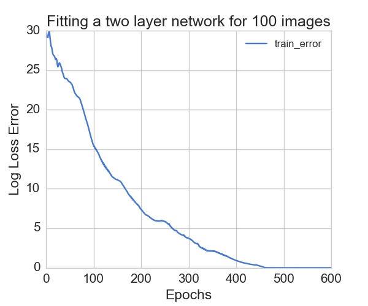 | 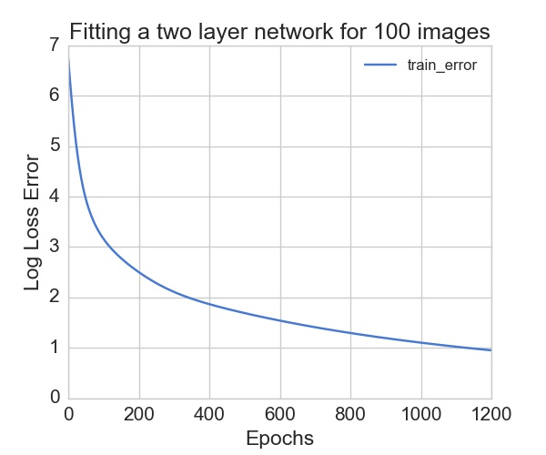 |
|:--: | :--: |
| Training error goes to zero, here activation is relu | Training error saturates when activation is sigmoid, which indicates that gradients are vanishing. We explore this further, but our sanity check succeeds. |

## Testing for Shallow Network

### Comparing error w/o regularization for shallow network

We compare error rates when we use no regularization vs when we use ridge and lasso regularization for different model parameters

* No. of hidden layers = 1
* Activation = ReLu
* Regularization = Ridge

| 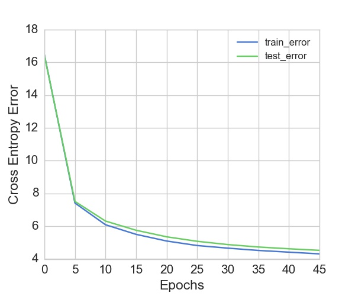 | 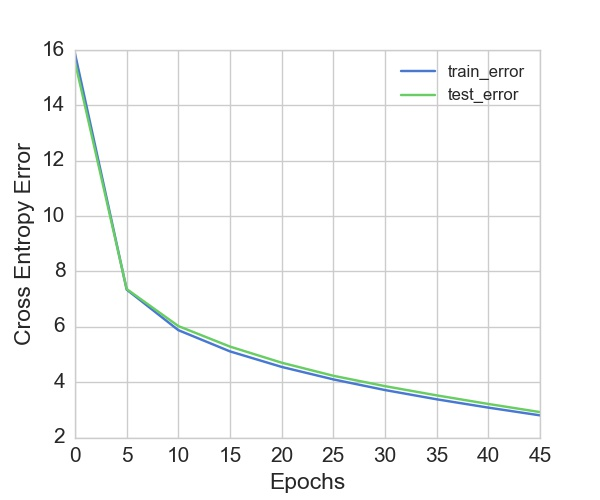 |
|:--: | :--: |
| model params: total_layers = 3 ,activation = relu ,**weight_penalty = 0** ,hidden_layer_size = 600 |   model params: total_layers = 3 ,activation = relu ,**weight_penalty = 0.1** ,hidden_layer_size = 600,  |
We observe that with regularization(ridge), both the training and testing error decrease. This is unusual, as regularization should increase training error. 

### Comparing error for L1 and L2 regularization for shallow network

| 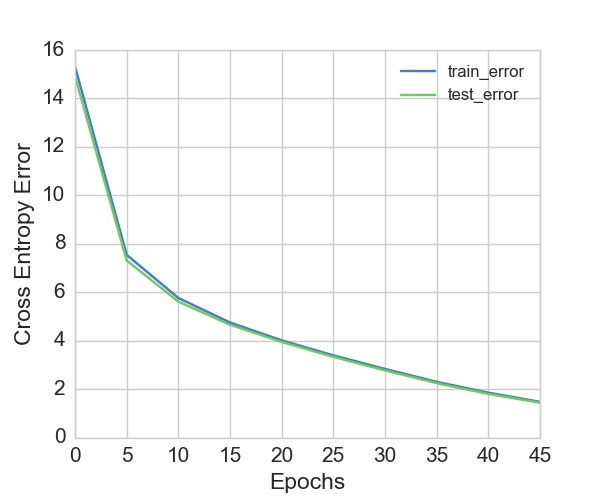  |  |
|:--: | :--: |
| model params: total_layers = 3 ,activation = relu ,weight_penalty = 0.1 ,hidden_layer_size = 600, **penalty = lasso** |   model params: total_layers = 3 ,activation = relu ,weight_penalty = 0.1 ,hidden_layer_size = 600, **penalty = ridge** |

We observe that using L1 regularization results in lower error , both for training and testing sets, when done for same no. of epochs

### Comparing error with and without dropout for shallow network

|  | 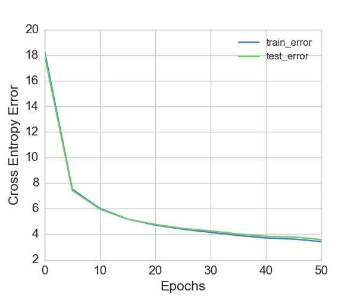 |
|:--: | :--: |
| model params: total_layers = 3 ,activation = relu ,weight_penalty = 0 ,hidden_layer_size = 600, **dropout_keep_prob = 1** | model params: total_layers = 3 ,activation = relu ,weight_penalty = 0 ,hidden_layer_size = 600, **dropout_keep_prob = 0.6** |
The image on left has no dropout. By adding a dropout layer to the shallow network, we observe that both training and testing error go down. So we see that dropout is effective for shallow networks. 

### Comparing error with dropout vs regularization for shallow network

|  |  |
|:--: | :--: |
| **dropout_keep_prob = 0.6, weight_penalty = 0** | **dropout_keep_prob = 1, weight_penalty = 0.1** |
We see that even though dropout is way of regularizaing, for a shallow network, conventional regularization gives comparable results. With more tuning of parameters, it might be possible to make the error values of model equal.

### Perturb input with noise while training for shallow network

While training the network, we perturb the input with a Gaussian Noise of zero mean and 2.5 (= 255/100) standard deviation, and compare the resulting errors with regularization case. 

|  |  |
|:--: | :--: |
| X = X + $ \sigma(0,2.5) $ | ridge penalty, $\alpha = 0.1$ |
We observe that the effect of adding input noise in very much similar to the regularization scheme.

### Comparing error with different hidden layer sizes for shallow network

We compare the models on zero-one accuracy on the test set. Our hypothesis is that as the layer width increases, the performance should increase

| Hidden Layer size | 200 | 600 | 1000 | 1400 |
| :--:  | :--: | :--: | :--: | :--: |
|  Test Accuracy | 0.782 | 0.798 | 0.812 | 0.819 |

We observe that as we increase the size of hidden layer, the test accuracy increases.

## Testing for deep network

### The case of NANs 

* While training deep networks, as the data propagates through layers, the values gets multiplied with weight matrices, which if have small numbers in them, make the signal too small to be of use, and if have large numbers in them, make the signal too large.
* Thus, the final softmax layer recevies zeros or infs in its inputs, which results in NAN outputs from the network.
* This is because of the initialization of weight matrices. We use the `Xavier` scheme for initialization of deep networks along with relus as activation units.

### Comparing error w/o regularization for deep network

We compare the network without regularization vs netowork with ridge regularization
|  | 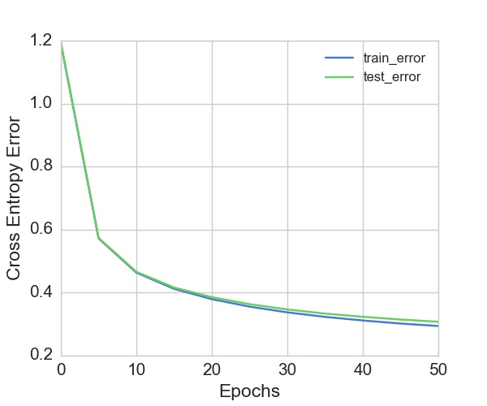 |
|:--: | :--: |
| model params: total_layers = 7 ,activation = relu ,**weight_penalty = 0.0** , hidden_layer_size = 400 | model params: total_layers = 7 ,activation = relu ,**weight_penalty = 0.001** , hidden_layer_size = 400  |

### Comparing error for L1 and L2 regularization for deep network
| 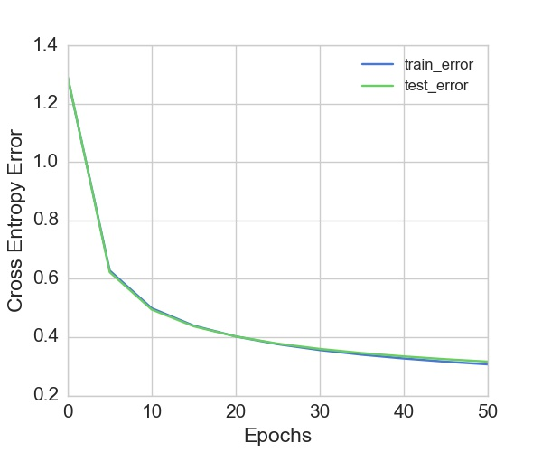 |  |
|:--: | :--: |
| **penalty_type = lasso** | **penalty_type = ridge** |
Both the models achieve accuracy of ~0.90, which is 0.1 (10%) more than their shallow counterparts. 

### Comparing error with dropout at every layer vs at only last hidden layer 

| 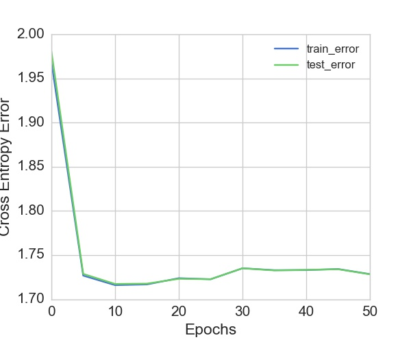 | 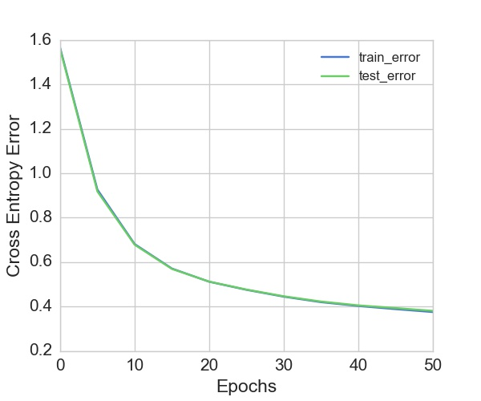 |
|:--: | :--: |
| dropout at every layer, with dropout_keep_prob = 0.5 | dropout at only final hidden layer, with dropout_keep_prob = 0.5  |

* We observe that a dropout of 0.5 at every layer is too expensive for the network as the cross entropy loss is too high, and the final accuracy achieved by the model is also only 0.55.
* A dropout only at last layer causes less loss of accuracy, while also preventing overfitting as training and testing error are nearly same.

### Comparing error with and without dropout for deep network

|  |  |
|:--: | :--: |
| No dropout | dropout at last hidden layer with p = 0.5  |
* We observe that, for the fixed no. of epochs, network without dropout has lower train error, and there is a gap between test and train error
* When we add dropout, we observe that the difference between train and test error reduces, which indicates the model is not overfitting and is generalizing well

### Comparing error with dropout vs regularization for deep network

|  |  |
|:--: | :--: |
| dropout at last layer | L2 regularization  |
We see that droput has a similar effect of regularization, as in both cases, train and test error don't differ much.

### All relus and all sigmoids, error and accuracy after same no. of epochs

We train a deep network, once with sigmoid activations and once with relu activations, and compare their errors after same no. of epochs

| 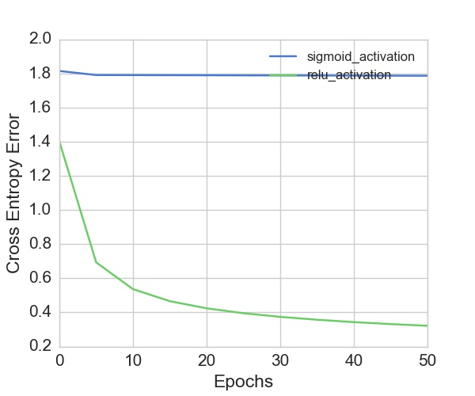 | 
|:--: | 
| Relu vs sigmoid for a deep network |

* We observe that not only the error for sigmoid is high, its rate of change is also very slow.
* We can easily conclude that the weights are not being updated in the network, and the network is not learning as quickly as its relu counterpart. 
* We attribute this to two reasons:
  * Vanishing gradients, as gradients flow back into starting layers of the network, they get multiplied by layer activations, which may decrease their norm
  * The saturating of sigmoid fuctions for values away from zero, this kills the gradient flowing through these units. This is not a problem with ReLu.

### Comparing different widths of deep network

We train deep networks with five hidden layers, and multiple widths, albeit all hidden layers having the same width, with L2 regularization. Here are the findings:

| Hidden Layer size | 400 | 1200 |
| :--:  | :--: | :--: |
|  Test Accuracy | 0.901  | 0.911 |
The gains are significant, but the model is much more complex than the simpler ones which easily achieve 90% accuracy
### Comparing different depths of deep network

We train deep networks with width = 200 for multiple depths with L2 regularization. Here are the results.

| No. of Hidden Layers| 2 | 6 | 10 |
| :--:  | :--: | :--: | :--: |
|  Test Accuracy | 0.878 | 0.894 | 0.890 |

For the network which is 10 layers deep, we observe that the train and test error diverge a little, so we can conclude that network is probably overfitting the data.

| 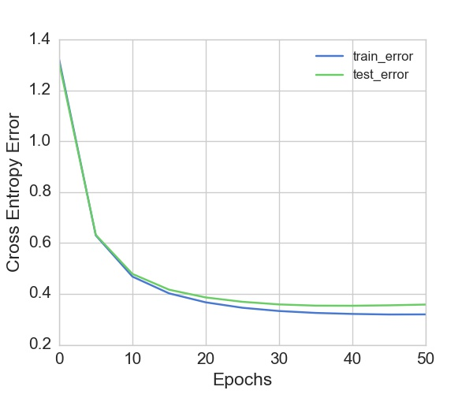 | 
|:--: | 
| Relu vs sigmoid for a deep network |