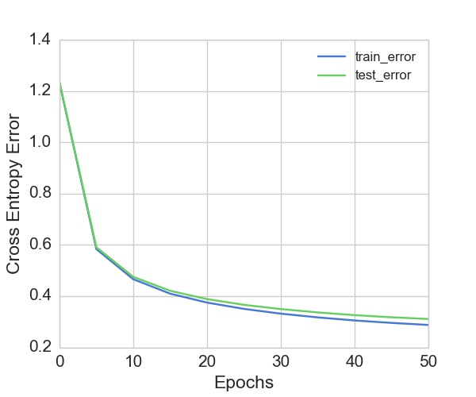

# mini-Keras

This project is toy clone of Keras, and implements basic learning algorithms for training deep neural networks.

## Introduction

This project implements a neural network in python from scratch.  We use the scientific computation library numpy to vectorize the calculations, and try to mimic the API provided by Keras for Sequential models.

We implement activation functions, backpropagation algorithm, dropout, regularization, loss functions and metrics for accuracy.


## Code Walkthrough

The code is divided across different modules, with the main modules being: 

* **Sequential.py**

  This is the main workhorse of the project, where the code for defining and training the model is written. It provides the `Sequential` class, which is used to define the model. Layers are added to model using the `add()` method. 

  ```python
  # code for creating and training a model
  model = Sequential()
  model.add(Layer(size = INPUT_SIZE))
  model.add(Layer(size = HIDDEN_LAYER_size, activation = 'sigmoid'))
  model.add(Layer(size = OUTPUT_SIZE, activation = 'softmax'))
  model.compile(learning_rate = 0.001, weight_penalty = 0.001, penalty = 'ridge')
  model.fit(X_train, Y_train, iterations = 100)
  ```

* **activations.py**

  This module implements the various activation functions, along with their gradients. The activation functions currently available are `sigmoid` ,`relu`  and `linear` .

* **losses.py**

  This module implements the loss functions. Since this assignment had classification task, currently it only implements `cross_entropy_loss`

* **metrics.py**

  This module implements the various metrics, like accuracy , the user might want to monitor during the training and testing. It implements a zero-one loss function currently.

Read the source for better understanding of implementation details.
## Usage
The following is the code for defining a deep feed forward neural network. (The same network is trained on EMNIST dataset for sanity check, later)
```python
input_size = 784
hidden_layer_size = 1200
activation = 'relu'
weight_penalty = 0.01

# define a sequential model
model = Sequential()
# the first layer has to be always the layer with input size and no activation
model.add(Layer(size=input_size))   
model.add(Layer(size=hidden_layer_size, activation = activation, type = 'dropout', dropout_keep_prob=1))
model.add(Layer(size=hidden_layer_size, activation = activation, type = 'dropout', dropout_keep_prob=1))
model.add(Layer(size=hidden_layer_size, activation = activation, type = 'dropout', dropout_keep_prob=1))
model.add(Layer(size=hidden_layer_size, activation = activation, type = 'dropout', dropout_keep_prob=1))
model.add(Layer(size=hidden_layer_size, activation = activation, type = 'dropout', dropout_keep_prob=1))
# Only classification is supported, so last layer has to be a softmax layer. For more understanding, dive into source
model.add(Layer(size= output_size, activation='softmax'))
# compile the model
model.compile(learning_rate=0.001, regularization= 'ridge', weight_penalty= weight_penalty)
# fit the model on the data
model.fit(x = X_train, targets=Y_train,iterations= 100)
```

### Sanity Check

To verify that the code implements the algorithms correctly, we use a subset of the **EMNIST** dataset for training and testing. We choose six letters *a,d,e,g,h,p* from the dataset. Images are 28*28 in dimensions, and labels are one hot encoded into six dimensional vectors, corresponding to six letters. The following is the graph of error vs epochs. Test accuracy is 90.01%



### Points of difference between shallow and deep networks

The library was first developed for a shallow network, and then gradually extended for deep networks. The following changes had to be made, based on this excellent [chapter](http://neuralnetworksanddeeplearning.com/chap5.html) to enable training of deeper networks

* **Xavier Initialization**
Initialization of weight matrices plays a key role, as it turns out. Refer this [post](http://andyljones.tumblr.com/post/110998971763/an-explanation-of-xavier-initialization) for a better understanding of why it is needed.

* **Relu vs Sigmoid**
Sigmoidal activation layers make the gradient vanish as it flows backwards. This is mitigated by using Relu layers.

* **Dropout**
A deep neural network is prone to overfit the data because of its power to learn arbitrary functions. This is mitigated by using dropout.